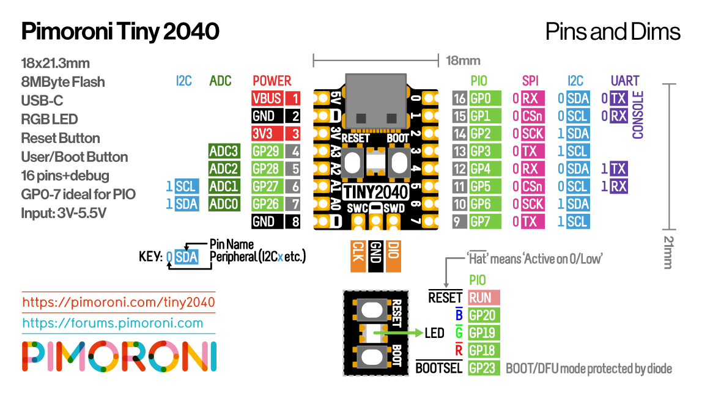

# TraceR and the Tiny 2040 Board 

This repository is a starting point where I'm testing out the proof of
concept, with respect to the microprocessor (RP2040), the operating
system I want to use (Micropython), and the combination of the modules
I'll be using (Tiny 2040, 0.49 inch OLED w/1306 driver, and a SDI
peripheral (simulated by a 74HCT595 for these tests).

## Proof of Concept Hardware

Prior to receiving the the TraceR PCBs, I decided to test out as much as
I could using the major parts, or their stand-ins, and a breadboard.

#### Pimoroni Tiny 2040

  - [Pimoroni site](https://shop.pimoroni.com/products/tiny-2040)
  - [Tom's Hardware Review](https://www.tomshardware.com/reviews/pimoroni-tiny-2040-review)

#### OLED 0.49 inch I2C Display

I purchased mine at [Devicemart](https://www.devicemart.co.kr/main/index) 
just for convenience and shipping speed. These are available from
various vendors:

* [Devicemart #13688372](https://www.devicemart.co.kr/goods/view?no=13688372)
* Amazon, for example [here](https://www.amazon.com/dp/B07DWZCJQM) and
  [here](https://www.amazon.com/dp/B082GFZ3GB)
* eBay, for example [here](https://www.ebay.com/itm/264388700693) and 
  [here](https://www.ebay.com/itm/233841168052)
* AliExpress, for example [here](https://www.aliexpress.com/item/1005001565201628.html) and 
  [here](https://www.aliexpress.com/item/33047471191.html)

These all appear to be based upon the WiseChip Semiconductor 0.49 in OLED
display (not to be confused with the 0.48 inch display by the same
company!)

* [https://www.wisechip.com.tw/en/product-553133/0-49”-OLED-Display.html](https://www.wisechip.com.tw/en/product-553133/0-49”-OLED-Display.html)

Or is it Allvision?
* [https://www.waveshare.com/w/upload/e/ec/SDD1306-30pin.pdf](https://www.waveshare.com/w/upload/e/ec/SDD1306-30pin.pdf)
* [https://www.szallvision.com/monochrome-oled-display-0-42](https://www.szallvision.com/monochrome-oled-display-0-42)

Also, they seem to be related to this thing called a WEMOS shield:

* [https://www.wemos.cc/en/latest/d1_mini_shield/oled_0_49.html](
   https://www.wemos.cc/en/latest/d1_mini_shield/oled_0_49.html)

A key point about this and similar modules is the driver chip. These
chips use the SSD1306 from Solomon Systech

* [https://www.solomon-systech.com](
  https://www.solomon-systech.com)
* [http://www.embeddedadventures.com/datasheets/SSD1306-Revision%201.1%20(Charge%20Pump).pdf](
  http://www.embeddedadventures.com/datasheets/SSD1306-Revision%201.1%20(Charge%20Pump).pdf)

#### Shift Register 74HCT595

Ordinary Nexperia shift register, 
[datasheet here](https://assets.nexperia.com/documents/data-sheet/74HC_HCT595.pdf)

## Basic Startup

User `Tonygo2` on this Tiny 2040 forum thread shows a simple program to
blink and change colors on the main LED. 

* https://forums.pimoroni.com/t/tiny-2040-rgb-led-control-tutorial/16604

Used this program successfully to confirm communications and ability to
program the Tiny 2040 board the first time out of the box.

* `flash/led_blinky.py`

## Firmware Experiments

#### UART / REPL Sharing

My initial worry was using the USB serial connection for both the REPL
and by the program.

Some users reported success in doing this on a Raspberry Pi Pico

* https://www.raspberrypi.org/forums/viewtopic.php?f=146&t=300474
* https://www.raspberrypi.org/forums/viewtopic.php?p=1806130#p1806130

The two are just interesting reports of using the Pico as a USB to dual
serial port bridge. Not needed at the moment, but noted here for future
reference.

* [https://www.raspberrypi.org/forums/viewtopic.php?t=302684](
  https://www.raspberrypi.org/forums/viewtopic.php?t=302684)
* [https://github.com/Noltari/pico-uart-bridge/releases](
   https://github.com/Noltari/pico-uart-bridge/releases)

Demonstrated REPL / IO sharing code based on demonstration scripts by
user `espresso1736` as posted in the 300474 thread link above. 

* `test-echo.py`
* `flash/echo.py`

#### Driving the Display

This tutorial shows an example of using an OLED screen in Micropython
on a Pico. 

* [https://www.tomshardware.com/how-to/oled-display-raspberry-pi-pico](
   https://www.tomshardware.com/how-to/oled-display-raspberry-pi-pico)

TODO: I might want slightly larger fonts. Here are a couple of writeups
on this issue:

* [https://forum.micropython.org/viewtopic.php?t=2650](
   https://forum.micropython.org/viewtopic.php?t=2650)
* [https://micropython-oled.readthedocs.io/en/latest/content/getting_started.html](
   https://micropython-oled.readthedocs.io/en/latest/content/getting_started.html)

#### Using SPI to Drive Shift Register

This post suggests SPI is working on the Pico (apparently it wasn't
supported upon initial release). And another post clarifying some points
about default pinouts.

* [https://forum.micropython.org/viewtopic.php?t=9801](
   https://forum.micropython.org/viewtopic.php?t=9801)
* [http://blog.rareschool.com/2021/02/raspberry-pi-pico-project-2-mcp3008.html](
   http://blog.rareschool.com/2021/02/raspberry-pi-pico-project-2-mcp3008.html)

I got it working after tweaking a few parameters to deal with the fact
that I was using a 595 shift register with LEDs temporarily as a
stand-in for a real SPI device. A few points I learned:

1. `firstbit = SPI.LSB` is not implemented on the Pico port. I wanted
   LSB first because of how my 8-LED display was physically oriented on
   the board. Bit reversal algorithm found here ( `function rbit8v()` ) 
   and implemented:

    * [Micropython Samples: reverse.py](
      https://github.com/peterhinch/micropython-samples/blob/master/reverse/reverse.py)

2. Had to invert my data to make a 1 indicate LED is ON, because of how
   the LEDs are connected.

3. The 74HCT595 shift register has a bunch of auxilliary control signals
   that a normal SPI device probably won't have. Implemented these in a
   class, see `flash/lib/sr595.py`. Note, however, that the final SPI
   device in this project is a Digipot that also has a few control
   signals, as well. Using this 595 shift register class as a basis for
   a new Digipot class will be easy.

## Programming Resources and References

Micropython supported on Raspberry Pi Pico boards, and a separate
document has been made available showing any points that are unique to
this family of MCUs.

* [Raspberry Pi Pico Python SDK (pdf file)](
   https://datasheets.raspberrypi.org/pico/raspberry-pi-pico-python-sdk.pdf)

Micropython documentation is really good, clearly laid out. Here is the
main page and a few key pages of interest to embedded programmers.

* [Micropython Documentation](https://docs.micropython.org/en/latest/index.html)
  - [UART](https://docs.micropython.org/en/latest/library/machine.UART.html)
  - [SPI](https://docs.micropython.org/en/latest/library/machine.SPI.html)
  - [I2C](https://docs.micropython.org/en/latest/library/machine.I2C.html)
  - [Pins](https://docs.micropython.org/en/latest/library/machine.Pin.html)
  - [Signals](https://docs.micropython.org/en/latest/library/machine.Signal.html)
  - [SSD1306](https://ssd1306.readthedocs.io/en/latest/api-documentation.html)

* Forums
  - [Micropython Forum](https://forum.micropython.org/)
  - [Raspberry Pi Pico Forums](https://www.raspberrypi.org/forums/viewforum.php?f=143)
  - [Pimoroni Discussin Forums](https://forums.pimoroni.com/c/discussion/26)

* [Raspberry Pi RP2040 Documentation](
   https://www.raspberrypi.org/documentation/rp2040/getting-started/)

## Tools

* [rshell](https://pypi.org/project/rshell)
* [Thonny](https://thonny.org)
* [Mu Editor](https://codewith.mu)

## Mechanical and Parts Notes

* tallest part on the back is RP2040 at 0.90 mm max

https://www.digikey.com/en/products/detail/samtec-inc/SSQ-102-03-G-D/1111461
https://www.digikey.com/en/products/detail/samtec-inc/SSQ-102-02-G-D/1110865

